# Elektrické odečty - aplikace pro Android

## O aplikaci

Elektrické odečty jsou aplikace pro průběžné sledování spotřeby elektrické energie. Umožňují zapisovat stavy elektroměru, evidovat měsíční odečty, porovnávat odhadovanou cenu spotřebované elektřiny se zaplacenými zálohami a ukládat údaje z vyúčtovacích faktur.

Aplikace je určena pro zařízení s operačním systémem Android. Minimální podporovaná verze je Android 6.0 (Marshmallow, SDK 23).

Hlavním účelem aplikace je poskytnout uživateli průběžný přehled o tom, zda zaplacené zálohy přibližně odpovídají skutečné spotřebě. Po zadání stavu elektroměru, ceníku a údajů z faktur aplikace dopočítává orientační cenu spotřebované elektrické energie. Díky tomu lze včas odhadnout, zda při dalším vyúčtování pravděpodobně vznikne přeplatek, nebo nedoplatek.

Aplikace pracuje s vysokým tarifem (VT), nízkým tarifem (NT), měsíčními zálohami, ceníky, fakturami, stálými platbami a dalšími položkami, které se podílejí na výsledné ceně elektřiny. Výpočty slouží jako uživatelská kontrola a orientační přehled. Skutečné vyúčtování je vždy určeno fakturou dodavatele elektrické energie.

## Odběrná místa

Odběrné místo představuje konkrétní místo spotřeby elektřiny, například byt, dům, garáž nebo chatu. V aplikaci lze vést více odběrných míst současně. Veškeré měsíční odečty, faktury, použité ceníky a další záznamy se vždy vztahují k aktuálně vybranému odběrnému místu.

Aktuální odběrné místo se vybírá v horní části obrazovky pomocí rozbalovacího seznamu. Pod ním se zobrazují základní údaje vybraného místa, například poznámka, hodnota hlavního jističe, číslo elektroměru a číslo odběrného místa. Tyto údaje pomáhají odlišit jednotlivá místa a zároveň slouží jako podklad pro některé výpočty, zejména u hodnot souvisejících s hlavním jističem.

Nové odběrné místo lze přidat pomocí tlačítka **+** v pravé dolní části obrazovky. Stávající odběrné místo lze upravit tlačítkem **Upravit odběrné místo**. Při úpravě se zadává název odběrného místa, poznámka, počet fází, hodnota jističe, číslo elektroměru a číslo odběrného místa.

Odběrné místo lze také odstranit tlačítkem **Smazat odběrné místo**. Tuto akci je vhodné používat opatrně, protože odstraněním odběrného místa se smažou také záznamy, které k němu patří, například měsíční odečty a faktury.

  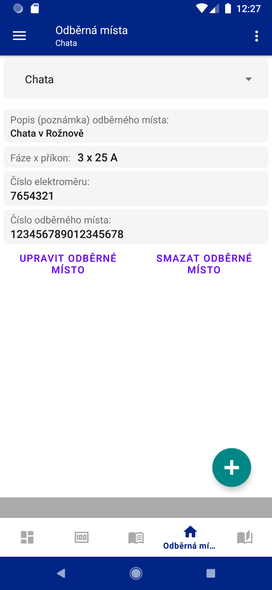
  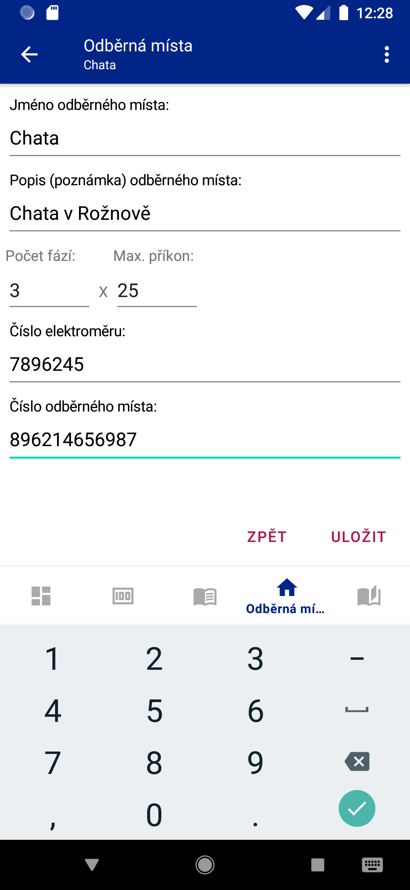

## Ceník

Ceník je důležitou součástí výpočtu v aplikaci. Nesprávně nastavený ceník může způsobit výraznou odchylku ve výpočtech, proto je jeho vytvoření v aplikaci co nejvíce zjednodušeno.

V seznamu ceníků se zobrazuje název produktové řady, období platnosti, název produktu, distribuční sazba, distribuční území a dodavatel. Ve spodní části položky je uvedena cena za 1 kWh ve vysokém tarifu, cena za 1 kWh v nízkém tarifu a stálá měsíční platba.

### Nový ceník

Nový ceník se přidává tlačítkem **+**. Při vytváření ceníku se zadává:

- název produktové řady,
- název produktu nebo sazby,
- dodavatel,
- distribuční sazba,
- distribuční území,
- období platnosti ceníku,
- celková cena za 1 kWh ve vysokém tarifu,
- celková cena za 1 kWh v nízkém tarifu,
- stálá měsíční platba.

Cena za 1 kWh se zobrazuje jako celková cena včetně DPH, tedy jako součet obchodní části, regulovaných položek a daně. Stálá měsíční platba se zobrazuje jako celková částka včetně DPH. Zahrnuje stálý plat dodavatele, cenu za jistič a cenu za provoz nesíťové infrastruktury. Pro ceníky platné pro rok 2023 se zobrazuje dvojí cena. Vyšší cena zobrazuje platné ceny od dodavatele a nižší cena zobrazuje zastropované ceny státem.

  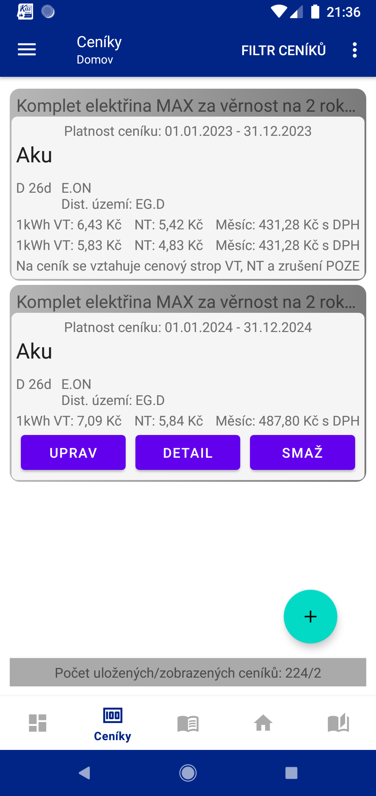

U jednotarifních sazeb, například D01d nebo D02d, se nízký tarif nepoužívá. Položku nízkého tarifu tedy není nutné vyplňovat podle samostatné ceny NT.

Aplikace obsahuje přednastavené regulované ceny od roku 2021 pro všechna tři distribuční území. Po výběru distribučního území, distribuční sazby a období platnosti se automaticky doplní regulované části ceníku. Uživatel proto obvykle zadává hlavně ceny podle svého dodavatele a výsledné hodnoty uvedené v ceníku.

Níže ve formuláři jsou zobrazeny regulované položky ceníku. V případě potřeby je lze upravit ručně, běžně to ale není doporučeno. Pokud je regulovaná cena změněna ručně, aplikace ji zvýrazní. Pokud v přednastavených regulovaných cenách najdete chybu, můžete ji nahlásit na e-mail **x.listo@seznam.cz**.

Datum platnosti je důležité pro správné přiřazení ceníku k měsíčnímu odečtu nebo faktuře. Platnost ceníku se kontroluje proti datu záznamu. Pokud aplikace najde nesoulad, zobrazí v záhlaví měsíčního záznamu nebo faktury upozornění.

Tlačítkem **Uložit** se ceník uloží. Tlačítkem **Zpět** se provedené změny zahodí a zobrazí se seznam ceníků.

  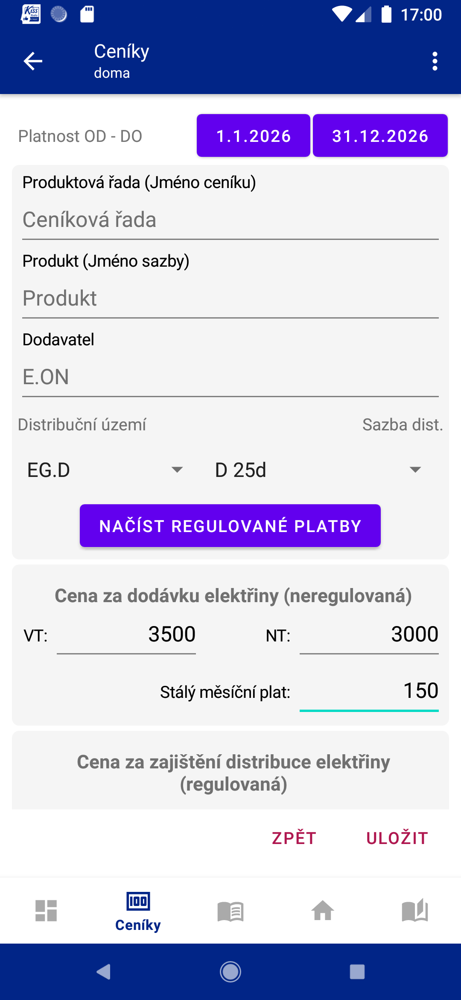
  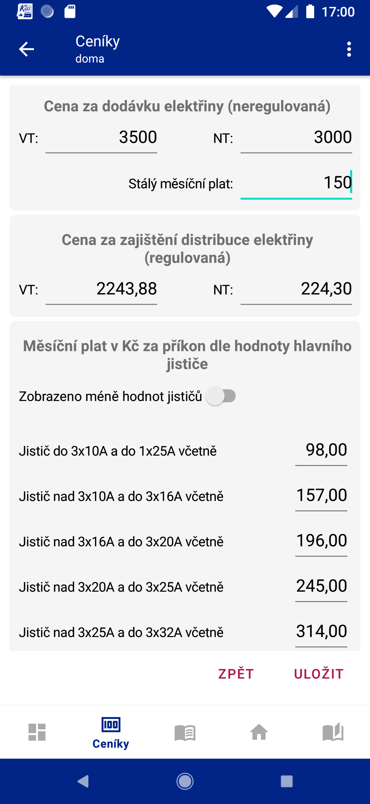

  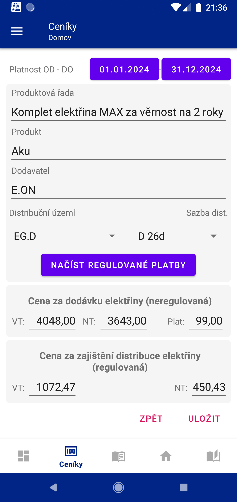
  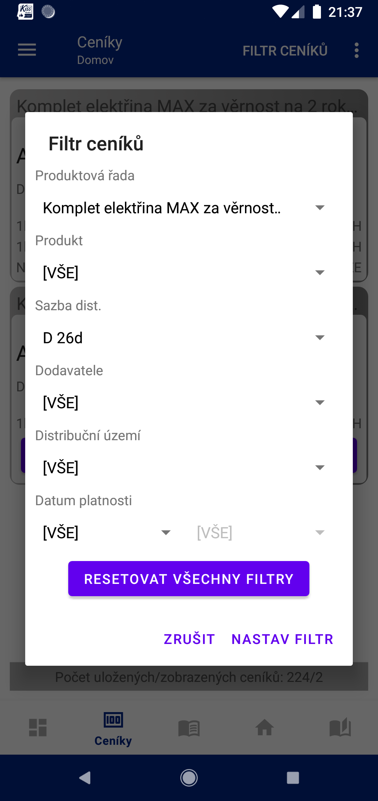

### Úprava ceníků

Klepnutím na položku ceníku v seznamu se zobrazí dostupné akce **Uprav**, **Detail** a **Smaž**.

Tlačítkem **Uprav** se otevře formulář podobný formuláři pro přidání nového ceníku. Rozdíl je v tom, že jednotlivá pole jsou již předvyplněna údaji vybraného ceníku. Tyto hodnoty lze podle potřeby změnit a uložit.

Ve formuláři je také tlačítko **Načíst regulované platby**. Slouží pro opětovné načtení regulovaných položek podle zvoleného distribučního území, distribuční sazby a období platnosti. To se hodí například v případě, kdy se regulované položky po změně výběru distribučního území nebo sazby z nějakého důvodu nenačtou automaticky.

Tlačítkem **Uložit** se změny uloží. Tlačítkem **Zpět** se provedené změny zahodí a zobrazí se seznam ceníků.

Tlačítkem **Detail** lze zobrazit podrobnosti vybraného ceníku bez úprav. Tlačítkem **Smaž** lze ceník odstranit. Mazání je vhodné používat opatrně, zejména pokud je ceník již použitý u měsíčních odečtů nebo faktur.

## Měsíční záznamy

Měsíční záznamy slouží k pravidelnému zapisování stavů elektroměru a k průběžnému výpočtu ceny spotřebované elektrické energie. Každý záznam se vztahuje k aktuálně vybranému odběrnému místu.

V seznamu měsíčních odečtů se zobrazují jednotlivé měsíce, spotřeba ve vysokém tarifu (VT), spotřeba v nízkém tarifu (NT), orientační cena spotřebované elektřiny, zaplacená záloha a rozdíl mezi vypočtenou cenou a zaplacenou zálohou. Záznam je barevně odlišen podle výsledku. Zelená barva označuje stav, kdy zaplacená záloha převyšuje vypočtenou spotřebu. Červená barva upozorňuje na stav, kdy vypočtená spotřeba převyšuje zaplacenou zálohu.

V horní části obrazovky je možné přepínat režim **Zkrácený**. Ve zkráceném zobrazení se zobrazují pouze nejdůležitější údaje. Po vypnutí zkráceného zobrazení se zobrazí podrobnější informace, například použitý ceník, jeho platnost, výše zálohy a grafická indikace stavu záloh.

Přepínač **Zastropované ceny v r. 2023** slouží pro přepočet záznamů podle pravidel platných pro rok 2023. U běžných novějších záznamů zůstává vypnutý.

  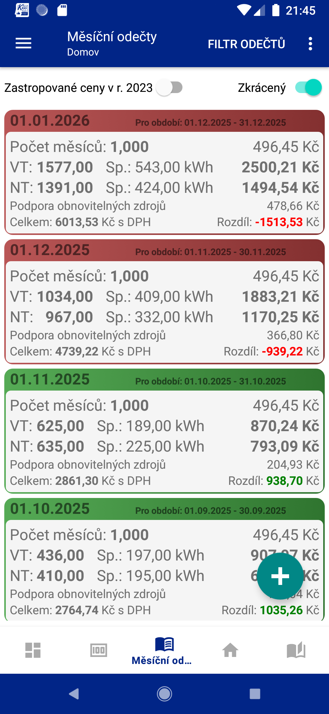
  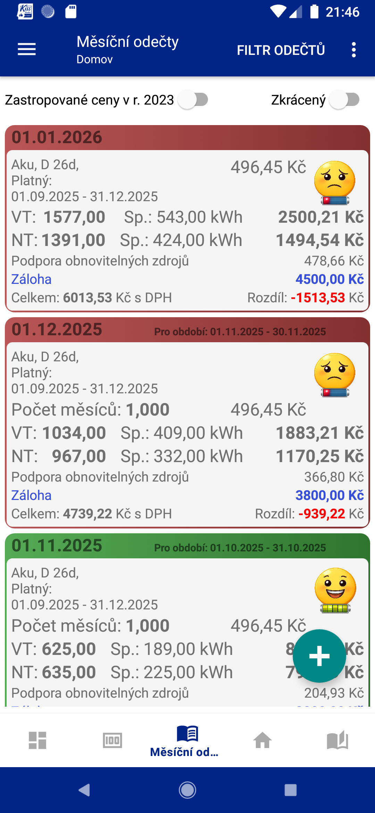

Pravidelným používáním aplikace vzniká delší seznam odečtů. Pro lepší orientaci lze použít tlačítko **Filtr odečtů**. Filtr umožňuje zobrazit pouze záznamy v určitém období. Nastavuje se počáteční datum v části **Měsíční odečty OD** a koncové datum v části **Měsíční odečty DO**. Tlačítkem **Filtrovat** se filtr použije, tlačítkem **Vynulovat filtr** se omezení zruší a znovu se zobrazí všechny záznamy. Tlačítkem **Zrušit** se dialog zavře bez použití změn.

Pokud je aplikován filtr, v horní části obrazovky se zobrazí souhrnná informace o vybraném období a celkové bilanci. V měsíčních záznamech se vždy počítá s dražší variantou POZE, tedy s částkou 495 Kč/MWh bez DPH. Výjimkou je rok 2026, kdy je tato část ceny snížena na 0 Kč/MWh.

  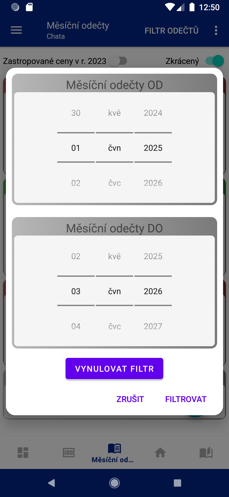
  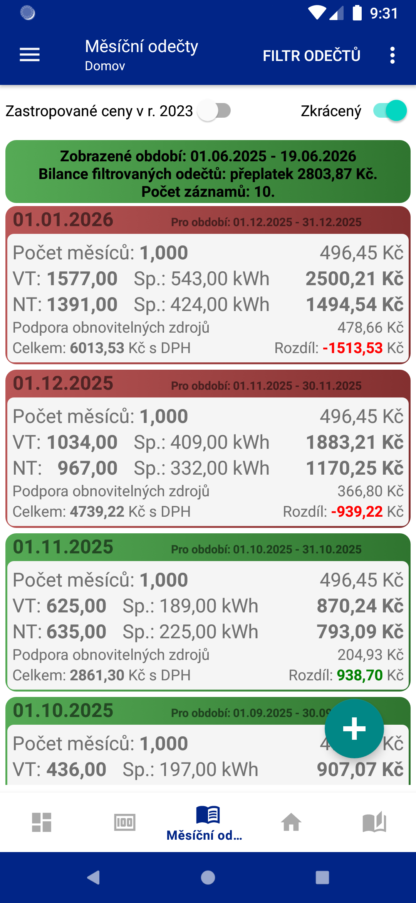

### Přidání měsíčního záznamu

Nový měsíční záznam se přidává tlačítkem **+** v pravé dolní části obrazovky. Otevře se formulář pro zadání odečtu.

U prvního měsíčního záznamu je nutné zadat počáteční stav elektroměru. Tento první záznam slouží jako výchozí hodnota, od které se budou počítat další měsíční spotřeby. Datum záznamu se nastavuje tlačítkem **Datum**. Po jeho stisknutí se otevře kalendář, ve kterém vyberete den odečtu.

Do formuláře se zadává:

- datum odečtu,
- stav počitadla vysokého tarifu,
- stav počitadla nízkého tarifu,
- pravidelná měsíční platba neboli záloha.

Při prvním záznamu a při záznamu typu **Výměna elektroměru** není položka měsíční zálohy dostupná.

Volba **Další údaje** zobrazí doplňková pole. Do poznámky lze zapsat vlastní informaci k odečtu. Položka **Další doplňkové služby nebo slevy** slouží pro jednorázové částky, které mají být připočteny nebo odečteny od výsledku za daný měsíc.

Tlačítkem **Uložit** se záznam uloží. Tlačítkem **Zpět** se formulář zavře bez uložení změn.

Při ukládání prvních měsíčních záznamů se může zobrazit upozornění na chybějící poslední fakturu. Toto upozornění souvisí s přesnějším navázáním měsíčních odečtů na fakturaci. Pokud aplikaci teprve začínáte používat a fakturu ještě nemáte zadanou, lze upozornění potvrdit a v zadávání pokračovat.

  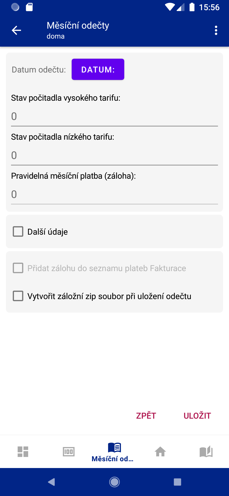
  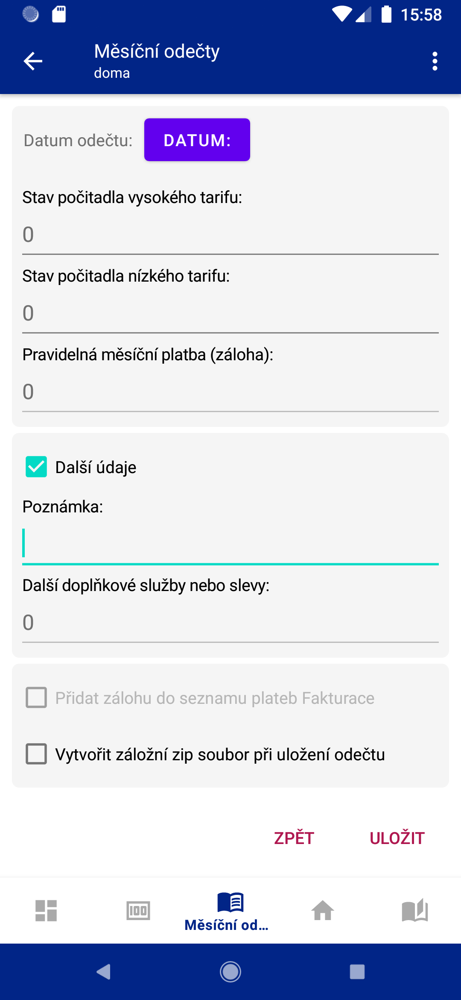
  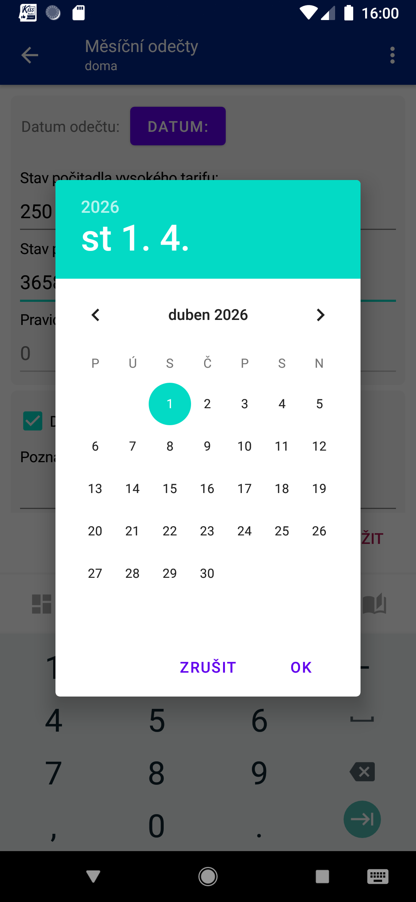

### Další měsíční záznamy

Při zadávání dalších měsíců se postup opakuje. Tlačítkem **+** otevřete nový záznam, nastavíte datum odečtu, zadáte aktuální stavy elektroměru a doplníte výši měsíční zálohy.

Aplikace porovná nový stav elektroměru s předchozím uloženým záznamem. Z rozdílu stavů vypočítá spotřebu ve VT a NT a podle vybraného ceníku dopočítá orientační cenu spotřebované elektřiny.

Ve spodní části formuláře jsou dostupné další volby:

- **Přidat zálohu do seznamu plateb Fakturace** – zadaná měsíční záloha se zároveň zapíše do plateb ve fakturaci, aby ji nebylo nutné doplňovat ručně.
- **Vytvořit záložní zip soubor při uložení odečtu** – při uložení záznamu se automaticky vytvoří lokální záloha dat.
- **Výměna elektroměru** – tato volba se používá při výměně elektroměru. Do záznamu se zadá konečný stav starého elektroměru, aby bylo možné správně navázat další odečty.

### Výběr ceníku pro měsíční záznam

Každý měsíční záznam musí mít přiřazený ceník, podle kterého se provede výpočet ceny. Pokud již byl v předchozím záznamu ceník použit, aplikace jej při dalším odečtu nabídne automaticky.

Ceník lze změnit tlačítkem pro výběr ceníku. Po jeho stisknutí se zobrazí seznam dostupných ceníků. Vybraný ceník označíte klepnutím na položku a potvrdíte tlačítkem **Vybrat**.

Pokud je v aplikaci uloženo větší množství ceníků, je vhodné použít [filtraci ceníků](#filtrace-ceniku). Pomocí filtru lze rychle zobrazit pouze ceníky odpovídající požadované distribuční sazbě, dodavateli, distribučnímu území nebo datu platnosti.

  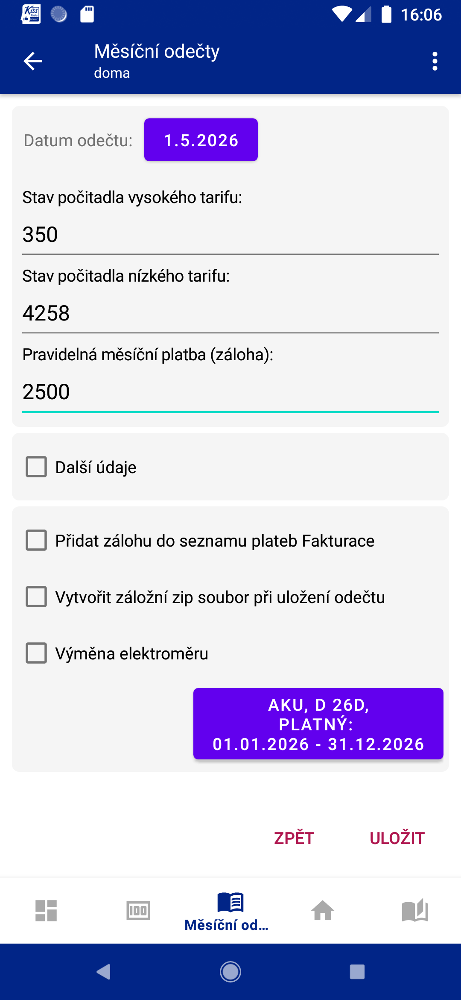
  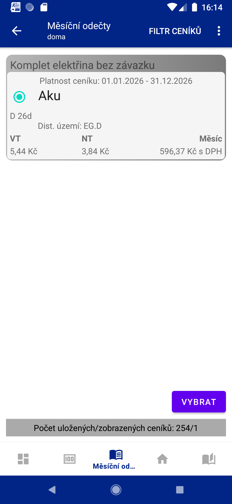
  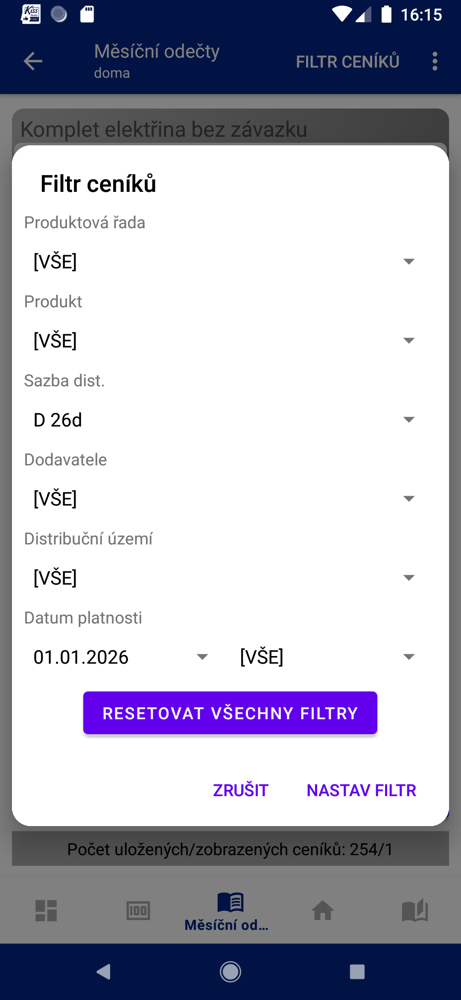

## Záznam faktur

V aplikaci lze ukládat již obdržené faktury a vést jejich historii. Díky tomu je možné zpětně zobrazit spotřebu, zaplacené zálohy a výsledek vyúčtování za jednotlivá období.

V seznamu faktur jsou zobrazeny všechny uložené faktury. První položkou je **Období bez faktury**. Tato část slouží k průběžnému výpočtu aktuální spotřeby od poslední uložené faktury po poslední měsíční odečet. Díky tomu lze sledovat, zda lze očekávat přeplatek, nebo nedoplatek ještě před obdržením dalšího vyúčtování.

Pokud v aplikaci není zadána žádná starší faktura, lze pro výpočet období bez faktury nastavit výchozí hodnoty ručně. Zadává se datum a počáteční stav měřičů VT a NT. U jednotarifních elektroměrů se pole NT ponechá na hodnotě 0.

Režim generování období bez faktury lze nastavit v menu. Dostupný je automatický a poloautomatický režim. Pokud jsou v poloautomatickém režimu provedeny ruční změny, přepnutím zpět do automatického režimu se tyto změny přepíší podle měsíčních odečtů.

  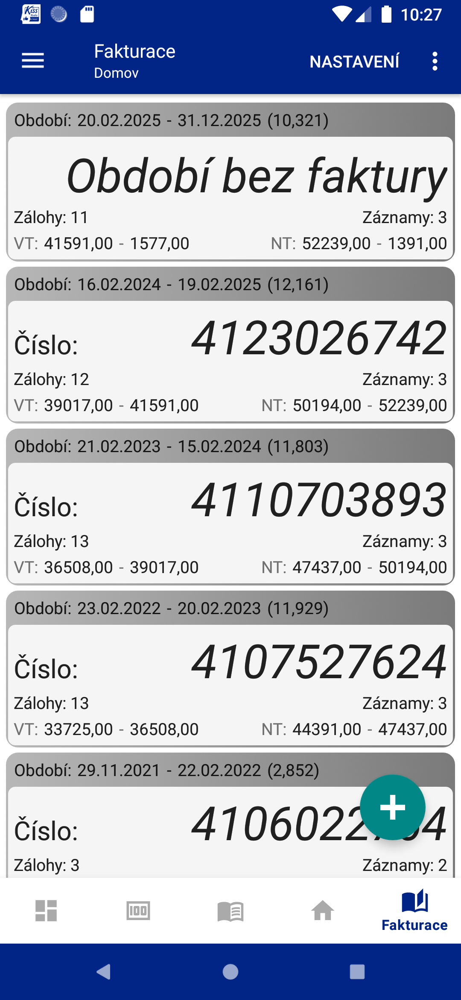
  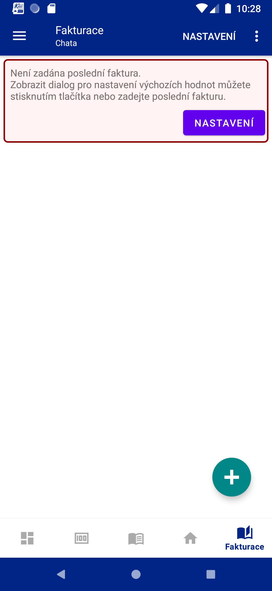
  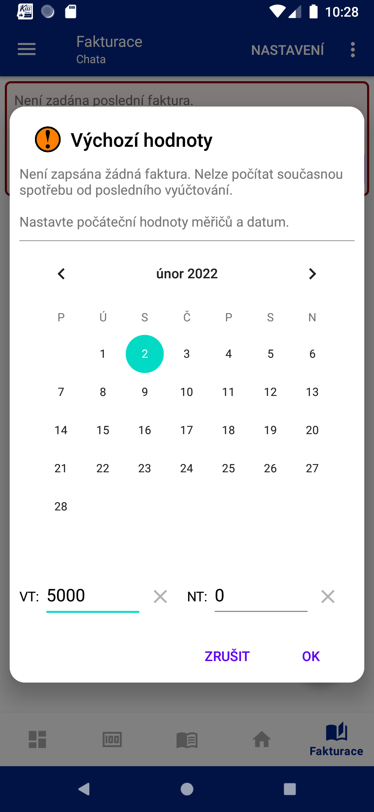
  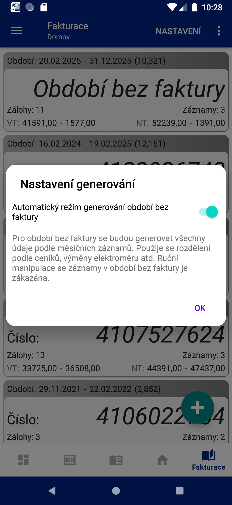

### Automatický režim

Automatický režim plně přebírá změny zapsané v měsíčních odečtech. Pokud je například v měsíčních odečtech změněn ceník nebo je zaznamenána výměna elektroměru, aplikace podle těchto údajů automaticky rozdělí celé období na odpovídající části.

Každá část období má vlastní datum, počáteční a koncový stav měřiče a příslušný ceník. Aplikace následně dopočítá spotřebu a cenu za celé období.

Pro většinu uživatelů je automatický režim nejjednodušší a nejvhodnější varianta, protože nevyžaduje ruční zásahy. Pokud některé údaje nesouhlasí, je vhodné je opravit přímo v měsíčních odečtech.

### Poloautomatický režim

Poloautomatický režim načítá pouze stav měřičů z poslední uložené faktury, případně z ručně zadaných výchozích hodnot, a poslední stav měřičů zadaný v měsíčních odečtech. Výsledkem je jeden souhrnný záznam, který automaticky nezohledňuje například výměnu elektroměru nebo změnu ceníku.

Rozdělení období na jednotlivé části je v tomto režimu plně na uživateli. Klepnutím na položku záznamu se zobrazí dostupná tlačítka pro úpravu.

- **Uprav** – otevře dialog, ve kterém lze změnit datum, stavy měřičů VT a NT, použitý ceník a případně označit záznam jako výměnu elektroměru. Tím se u dané položky vypne kontrola návaznosti stavů měřidel. Zašedlé údaje nelze měnit, protože jde o hraniční hodnoty převzaté z posledního měsíčního odečtu nebo poslední uložené faktury. Pokud je nutné tyto hodnoty změnit, je potřeba je upravit na příslušném místě aplikace.
- **Rozděl** – rozdělí jeden záznam na dvě části. V dialogu lze nastavit dělicí datum a stav měřičů VT a NT. Výchozí hodnota je nastavena přibližně na polovinu období. Hodnoty lze změnit posuvníky nebo zadáním do textových polí. V horní části dialogu je zobrazen náhled rozdělení. Tlačítkem **Rozděl** se záznam rozdělí na dvě navazující části.
- **Spoj s předchozím** – sloučí záznam se záznamem, který je v seznamu pod ním. V dialogu je zobrazen náhled slučovaných záznamů i výsledku po sloučení.

  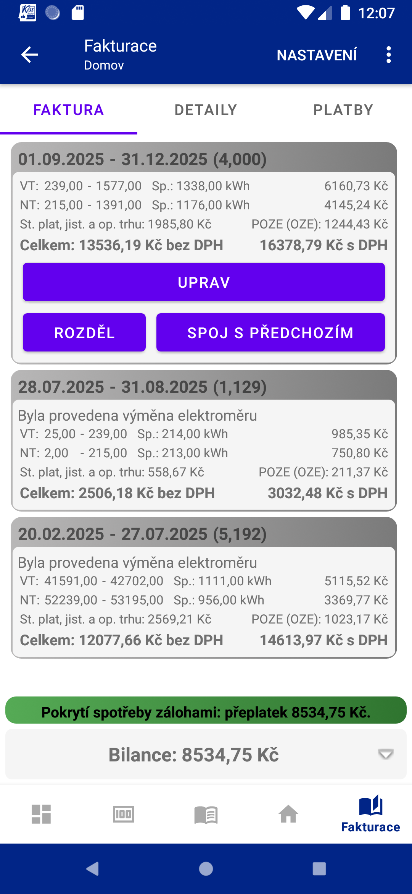
  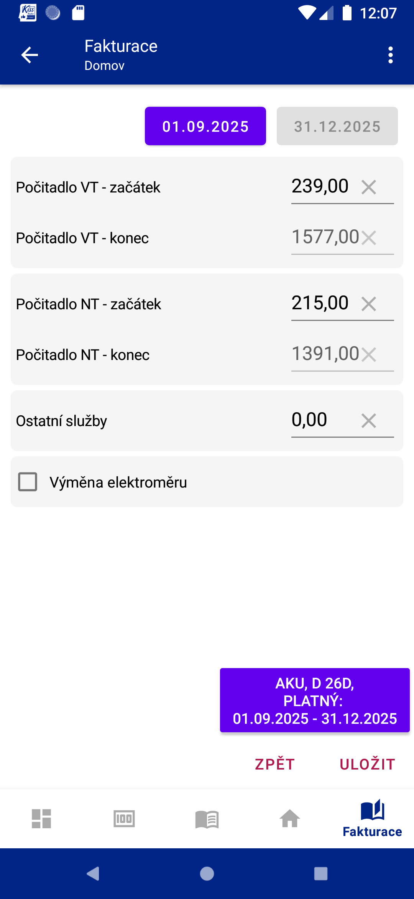
  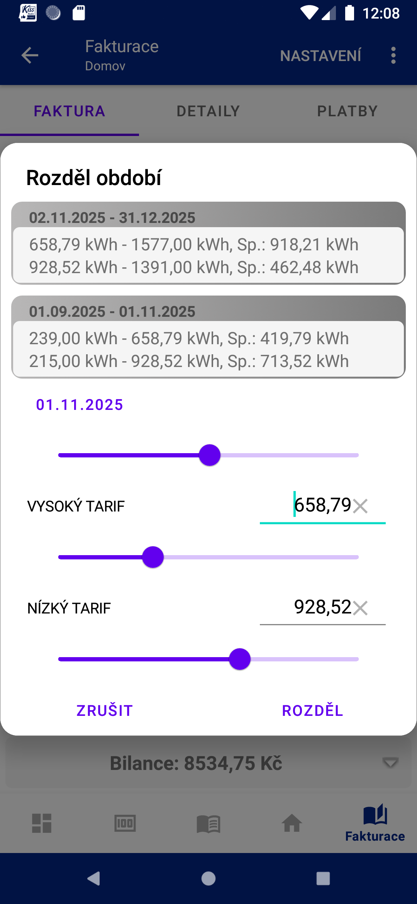
  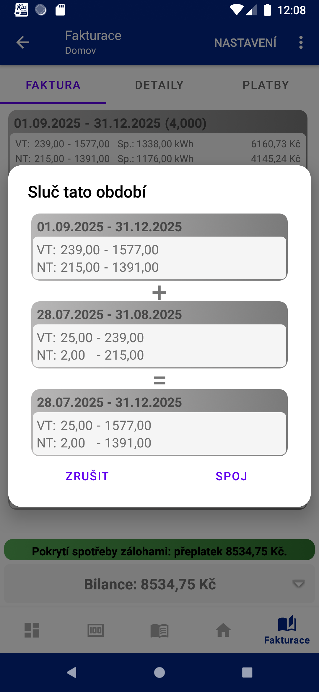

### Detail faktury

Faktura se zobrazuje ve třech záložkách: **Faktura**, **Detaily** a **Platby**.

První záložka **Faktura** obsahuje vlastní odečtové záznamy. Každý záznam má přiřazený ceník, podle kterého se počítá cena spotřebované elektrické energie. Pokud je záznamů více, celkový součet faktury se zobrazuje v dolní liště.

Klepnutím na spodní součet se zobrazí panel se všemi dostupnými součty. Lze vybrat položku, která se bude zobrazovat ve spodní části obrazovky:

- celková spotřeba VT,
- celková spotřeba NT,
- celková spotřeba VT a NT,
- cena VT bez DPH,
- cena NT bez DPH,
- cena stálých plateb bez DPH,
- cena na podporu obnovitelných zdrojů (POZE),
- celková cena bez DPH,
- celková cena s DPH,
- zaplacené zálohy,
- bilance.

Ve spodní části obrazovky se zobrazuje také rychlá informace o poměru zaplacených záloh k vypočtené ceně za dané období. Zeleně je označen přeplatek, červeně nedoplatek.

Druhá záložka **Detaily** zobrazuje dílčí výpočty faktury. Tuto část lze využít pro kontrolu proti faktuře od dodavatele a pro dohledání případných rozdílů ve výpočtech.

Třetí záložka **Platby** slouží k evidenci zálohových plateb, doplatků a přeplatků. Tyto platby slouží výhradně k výpočtu bilance za celé fakturační období a nesouvisí se zálohami zadávanými u měsíčních odečtů.

  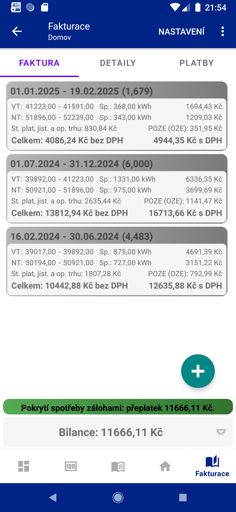
  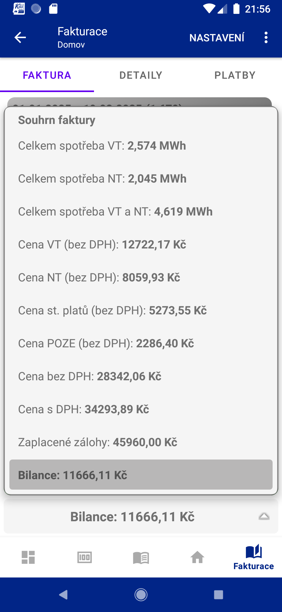
  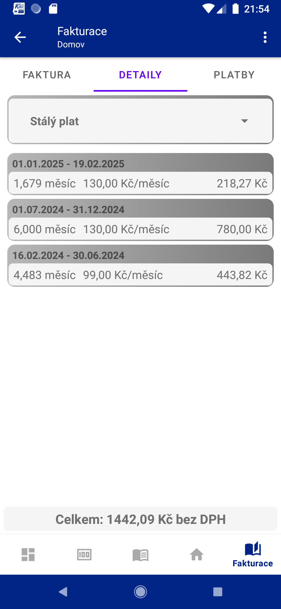
  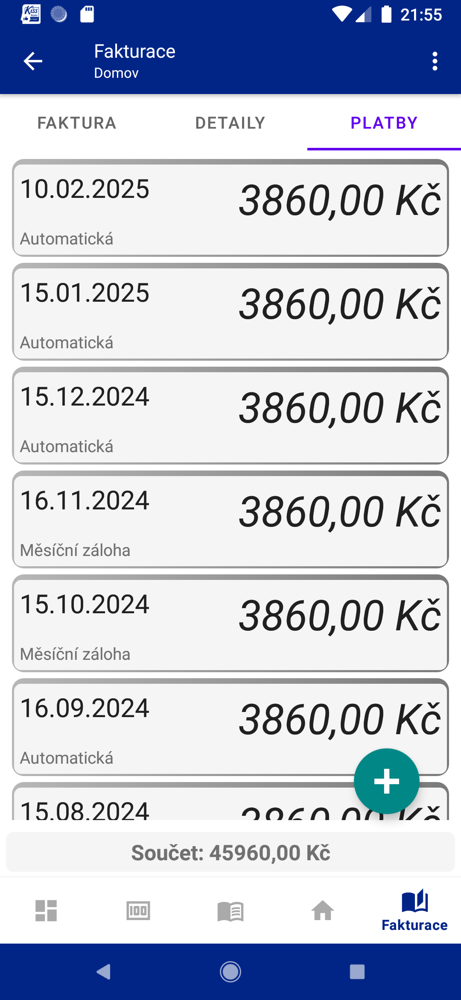

### Přidání a úprava uložených faktur

V seznamu faktur lze přidávat již existující vyúčtovací faktury. Dialog pro přidání nové faktury se otevře tlačítkem **+**.

Nejprve se zadá číslo faktury nebo jiné označení pro lepší orientaci. Po potvrzení se na konci seznamu vytvoří nová položka faktury. Nová faktura zatím nemá vyplněná data ani stavy měřičů, proto se u ní může zobrazit upozornění na nenavazující nebo neúplné záznamy.

Klepnutím na položku faktury se zobrazí její ovládací tlačítka. Lze změnit číslo faktury, přidat odečtové záznamy, přidat zálohové platby nebo celou fakturu smazat.

  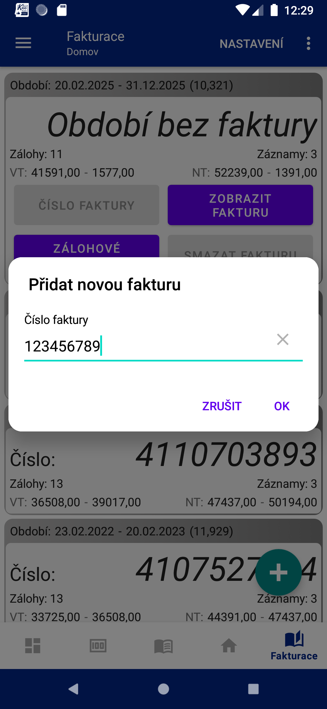
  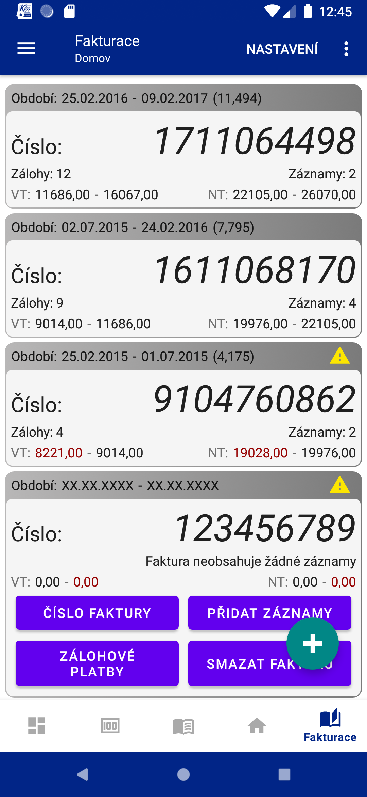

### Přidání a úprava zálohové platby

Tlačítkem **Přidat zálohové platby** se otevře obrazovka se zálohovými platbami vybrané faktury. Nová platba se přidává tlačítkem **+**.

U platby se zadává datum zaúčtování, výše platby a typ platby. Doplatek se ve výpočtu chová stejně jako zálohová platba. Přeplatek celkovou zaplacenou částku snižuje, aby se výsledná bilance mohla dorovnat na 0.

Již zadané platby lze upravovat. Klepnutím na položku platby se zobrazí tlačítka pro úpravu, odstranění nebo přiřazení platby k jiné faktuře. Dialog pro úpravu je stejný jako dialog pro přidání, pouze jsou v něm předvyplněné původní hodnoty. Smazání platby se provede po potvrzení dialogu.

  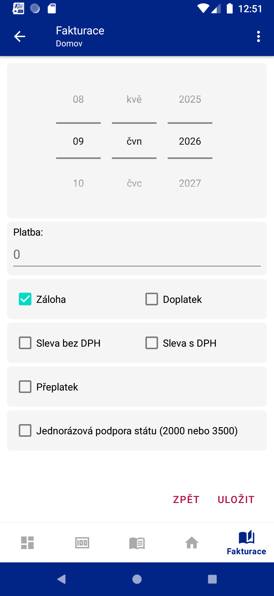
  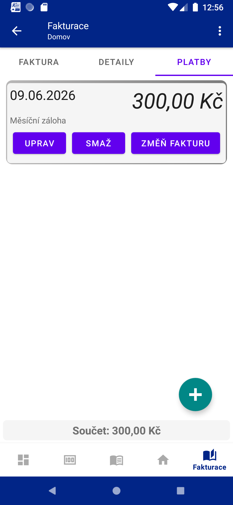
  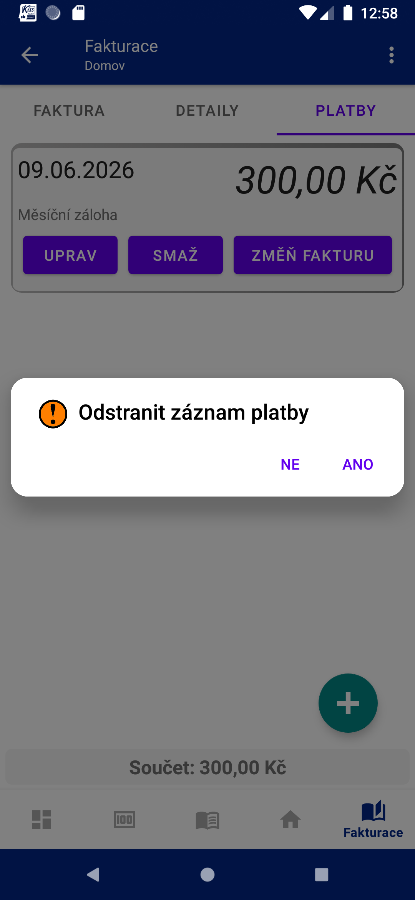

### Přidání a úprava záznamů faktury

Pokud je otevřena obrazovka zálohových plateb, lze se pomocí záložky přepnout zpět na záznamy faktury. Nový odečtový záznam se přidává tlačítkem **+**.

Při přidání nového záznamu aplikace předvyplní údaje tak, aby navazovaly na nejstarší záznam, který již byl v aplikaci zadán. Po vložení záznamu a zálohové platby se ve spodní části zobrazí bilance faktury. Stejný princip výpočtu se používá také u položky **Období bez faktury**.

Tlačítkem **Uprav** lze záznam změnit, pokud některá položka nesouhlasí. Záznam lze také odstranit po potvrzení dialogu. Funkce pro rozdělení a sloučení záznamů se u ručně uložených faktur nepoužívají, protože zde nejsou potřeba průběžné výpočty k aktuální spotřebě.

Po návratu do seznamu faktur je nově přidaná faktura zobrazena na konci seznamu. Pokud jsou údaje zadány správně a záznamy na sebe navazují, nezobrazuje se u faktury varování o nekonzistenci údajů.

  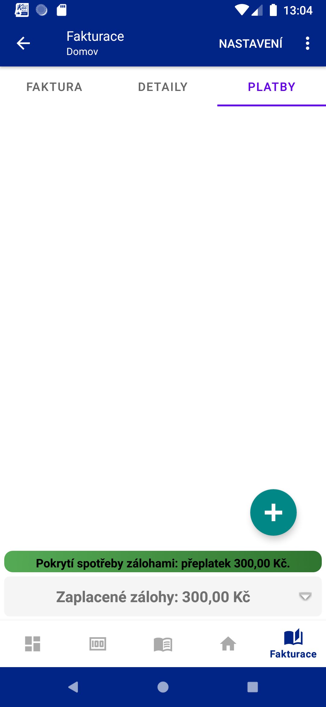
  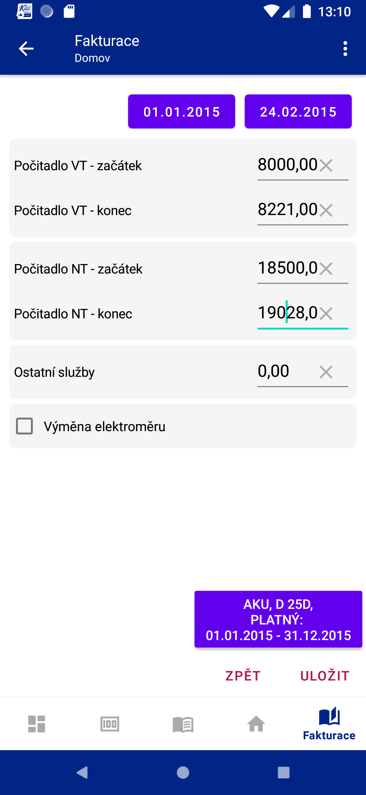
  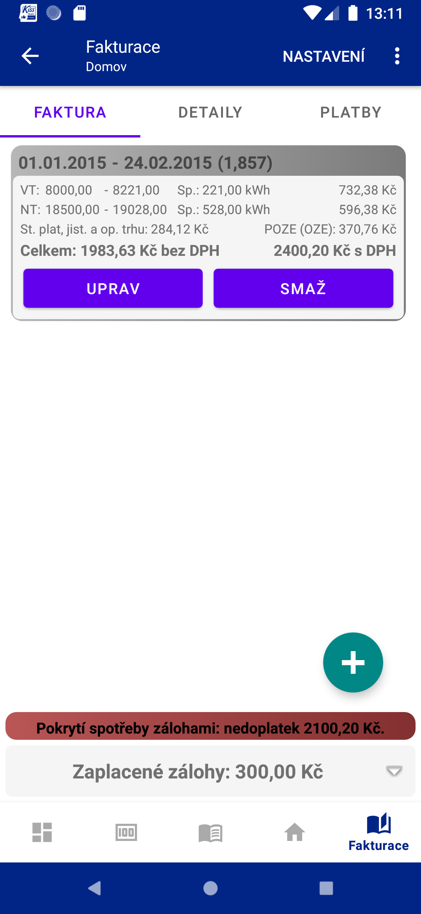
  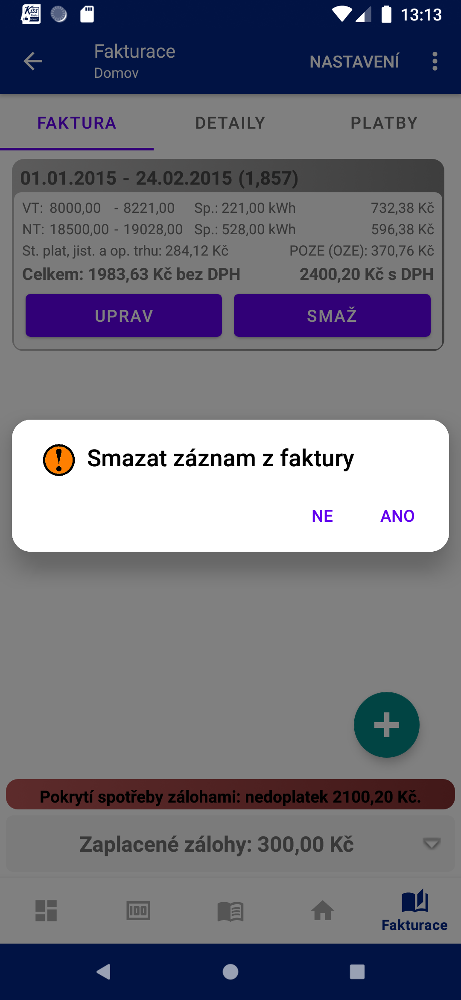
  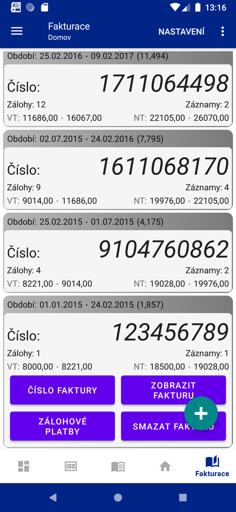

## Filtrace ceníků

Postupem času může být v aplikaci uloženo větší množství ceníků. Filtrace ceníků slouží k rychlému vyhledání pouze těch ceníků, které odpovídají konkrétnímu odběrnému místu, distribuční sazbě, dodavateli nebo období platnosti.

Filtr ceníků lze otevřít ze seznamu ceníků pomocí položky **Filtr ceníků** v horní liště. Stejný filtr se používá také při výběru ceníku pro měsíční odečet. Pokud se při zadávání měsíčního záznamu zobrazí příliš mnoho ceníků, je vhodné filtr použít a zúžit seznam pouze na relevantní položky.

V dialogu filtru lze nastavit více podmínek současně:

- **Produktová řada** – název celého ceníku nebo skupiny ceníků.
- **Produkt** – název konkrétního produktu nebo sazby v rámci ceníku.
- **Sazba dist.** – distribuční sazba, například D01d, D02d, D25d nebo D26d.
- **Dodavatel** – dodavatel elektřiny.
- **Distribuční území** – distribuční oblast, například ČEZ Distribuce, EG.D nebo PREdistribuce.
- **Datum platnosti** – období, ve kterém má být ceník platný.

U položky **Datum platnosti** lze použít pouze počáteční datum, nebo počáteční i koncové datum. Pokud je nastaveno pouze počáteční datum a druhé pole zůstane na hodnotě **[VŠE]**, filtr vyhledá ceníky, které začínají přesně zvoleným datem. Pokud je nastaveno i koncové datum, zobrazí se ceníky odpovídající celému zadanému období platnosti.

Toto nastavení je užitečné například v situaci, kdy ceník neplatí celý kalendářní rok, ale pouze část roku. Pomocí filtru lze vyhledat jak ceník končící v průběhu roku, tak navazující ceník začínající od dalšího období.

Tlačítkem **Nastav filtr** se zvolené podmínky použijí. Tlačítkem **Resetovat všechny filtry** se filtr vrátí do výchozího stavu. Tlačítkem **Zrušit** se dialog zavře bez použití změn.

Po použití filtru se ve spodní části seznamu zobrazí počet uložených a aktuálně zobrazených ceníků. Například údaj **254/1** znamená, že v aplikaci je uloženo 254 ceníků, ale podle aktuálního filtru je zobrazen pouze jeden z nich.

Ceník se vybere označením příslušné položky v seznamu a potvrzením tlačítkem **Vybrat**. Po návratu do měsíčního záznamu se vybraný ceník zobrazí ve formuláři odečtu a použije se pro výpočet spotřeby.

  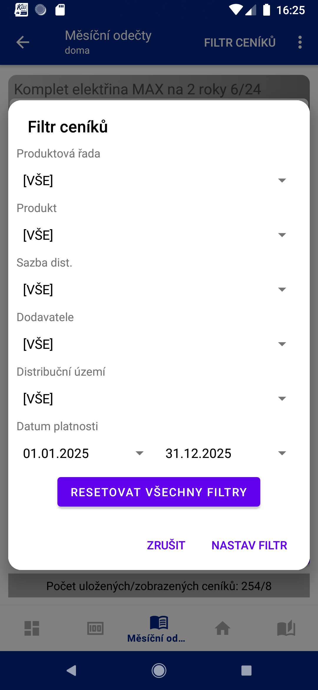
  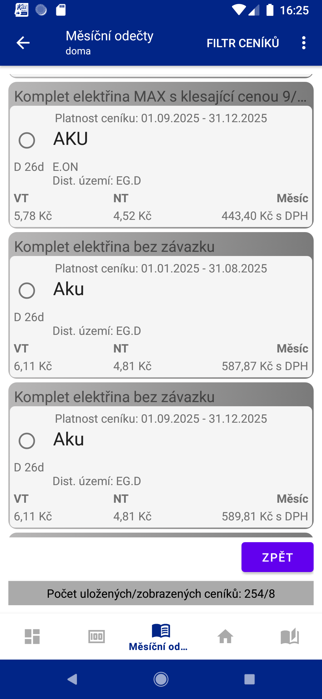

## Porovnání ceníků

Výhodnost jednotlivých ceníků nemusí být vždy na první pohled zřejmá. Proto aplikace umožňuje porovnání dvou ceníků mezi sebou. Porovnání probíhá formou výpočtu, kdy se zpravidla zadává období 12 měsíců a přibližná roční spotřeba ve vysokém (VT) a nízkém tarifu (NT). V porovnání se zobrazují rozdíly v jednotlivých částech i v celkovém výpočtu.

  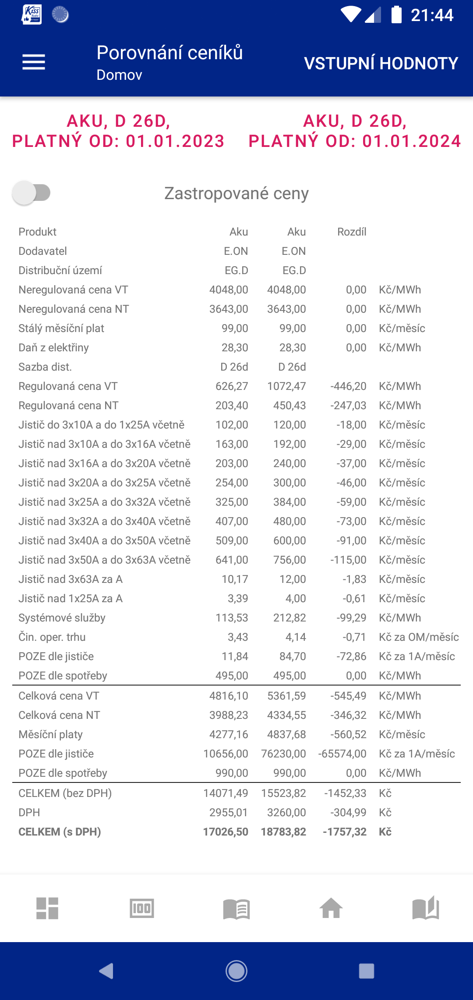

## Čas HDO

V aplikaci lze uložit časy nízkého tarifu (NT) a zobrazovat notifikace na jeho začátek a konec. Jednotlivé časy lze vložit nebo upravit ručně. Pokud je elektroměr vybaven spínačem HDO, lze podle HDO kódu načíst jednotlivé časy NT a uložit je v aplikaci.

V horní části je zobrazen čas elektroměru. Pokud elektroměr není vybaven přijímačem HDO se synchronizací času, jeho čas se nemusí shodovat se skutečným časem. Pomocí tlačítek lze čas upravit tak, aby odpovídal času nastavenému na elektroměru.

Nalezené seznamy časů je možné uložit do paměti aplikace. Touto akcí se přepíší původně uložené časy. Seznam časů lze také zkopírovat v textové podobě do schránky.

  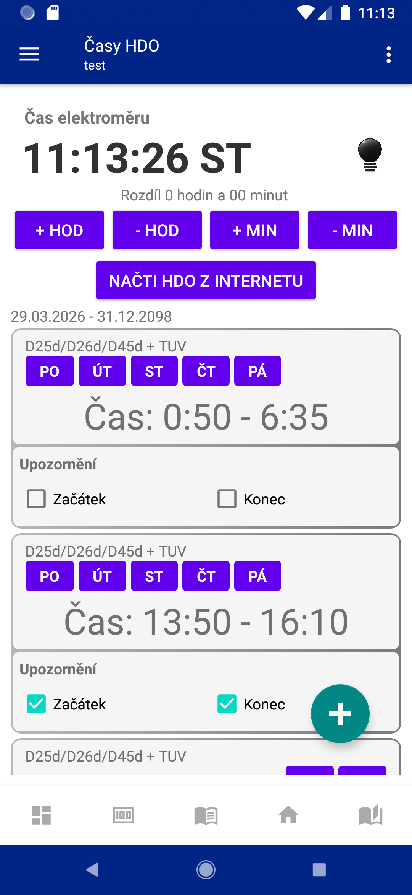
  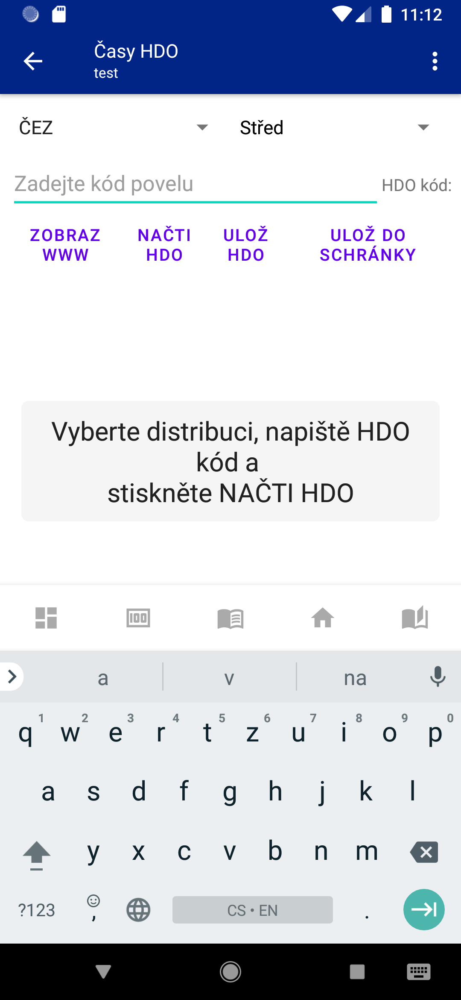
  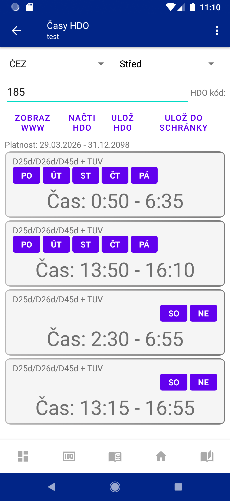

## Statistika spotřeby

Historickou spotřebu lze zobrazit ve sloupcovém nebo čárovém grafu, a to v ročních nebo měsíčních intervalech. Případně je možné porovnávat spotřebu mezi stejnými měsíci.

Prvním tlačítkem se přepíná mezi sloupcovým a čárovým grafem. Ikona tlačítka se mění podle aktuálně zobrazeného typu grafu. Druhým tlačítkem se mění interval zobrazených dat. Při kliknutí se interval spotřeby mění v pořadí: měsíční spotřeba → roční spotřeba → spotřeba v jednotlivých měsících.

Tlačítky **+** a **-** lze měnit hustotu vodorovných os pro zobrazení spotřeby.

  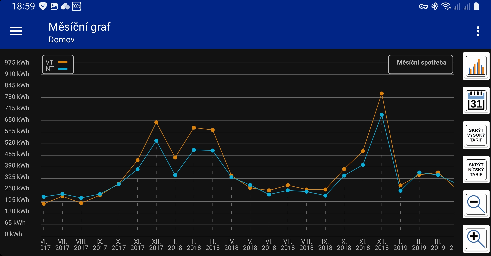

## Záloha lokální

Záloha dat je důležitou součástí aplikace. V této části lze vytvořit záložní soubor, obnovit data z vybrané zálohy nebo staré záložní soubory smazat. Pro bezpečné zálohování je vhodné ukládat záložní soubory i mimo telefon nebo tablet.

Zálohování do lokálního úložiště vyžaduje oprávnění pro přístup do vybrané složky. Tento přístup se uděluje při prvním nastavení složky, případně při její změně. Dialog pro nastavení složky pro zálohy se zobrazí kliknutím na ikonu složky v horní liště. Pokud ikona není vidět přímo, je dostupná jako položka v menu. Stejná složka se používá také pro export ceníků.

Záloha se vytvoří stiskem ikony aktovky se šipkou dolů. Záložní soubor lze také vytvářet automaticky při každém zadání měsíčního odečtu, pokud je zapnuta příslušná volba.

Krátkým klepnutím na položku zálohy se zobrazí tlačítka pro obnovení zálohy, odeslání na Google Drive a smazání. Dlouhým podržením položky se aktivuje vícenásobný výběr, pomocí kterého lze pracovat s více zálohami najednou.

Pro přenos záložních souborů do počítače nebo cloudu lze použít kabel pro propojení s počítačem, správce souborů nebo synchronizační aplikaci vybrané cloudové služby. Záloha obsahuje vnitřní databázi aplikace, tedy měsíční záznamy, ceníky, faktury a další uložená data.

Pokud zvolíte odeslání na Google Drive, vybraná záloha nebo skupina záloh se odešle do systémové části Google Drive určené pro konfigurační soubory aplikací. Odeslání proběhne pouze v případě, že jste přihlášeni Google účtem a udělili jste aplikaci potřebné oprávnění. Pokud není dostupné internetové připojení, úloha odeslání počká na dostupné mobilní nebo Wi-Fi připojení.

  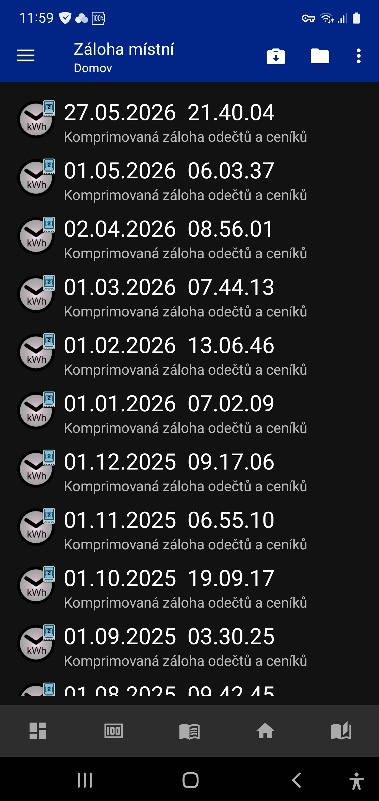
  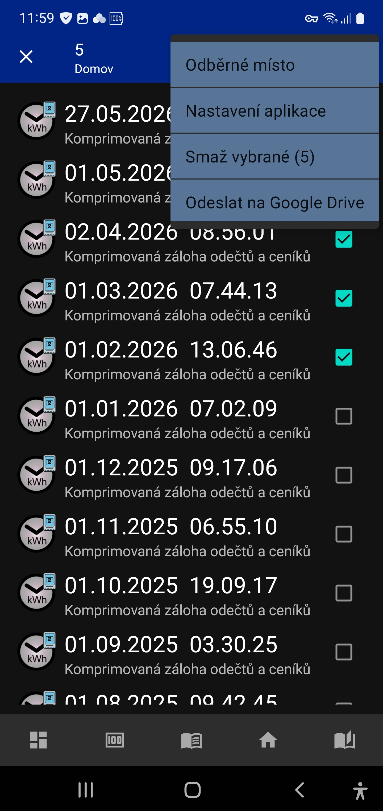
  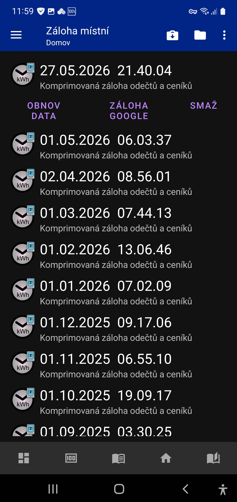

## Záloha Google

Tato část slouží k zobrazení záloh uložených v Google Drive v systémové části aplikace. Zálohy jsou uložené v prostoru vyhrazeném pro konfigurační soubory aplikací.

Aplikace nemá oprávnění číst běžné uživatelské soubory na Google Drive a nemůže k nim přistupovat. Má přístup pouze k záložním souborům, které sama vytvořila ve svém aplikačním prostoru.

Pro používání záloh na Google Drive je vyžadováno přihlášení Google účtem a udělení oprávnění aplikaci.

Funkce jsou podobné jako u lokální zálohy. Krátkým klepnutím na položku se zobrazí tlačítka pro obnovení zálohy, uložení záložního souboru do lokálního úložiště a smazání. Dlouhým klepnutím lze aktivovat vícenásobný výběr.

  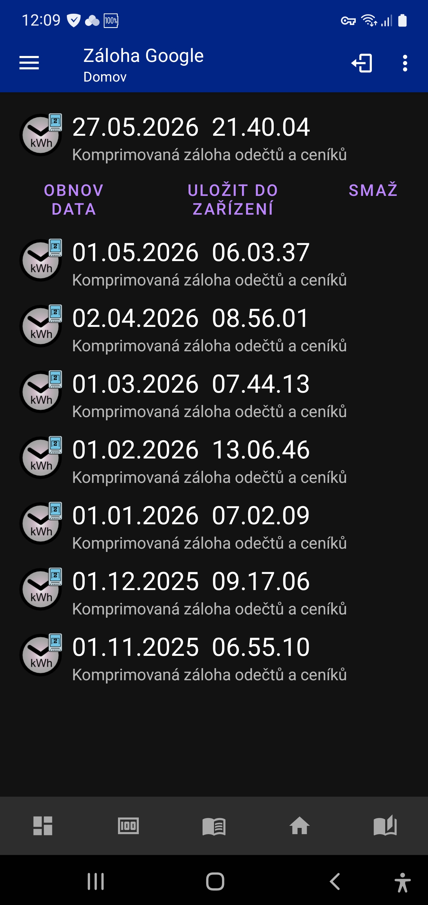
  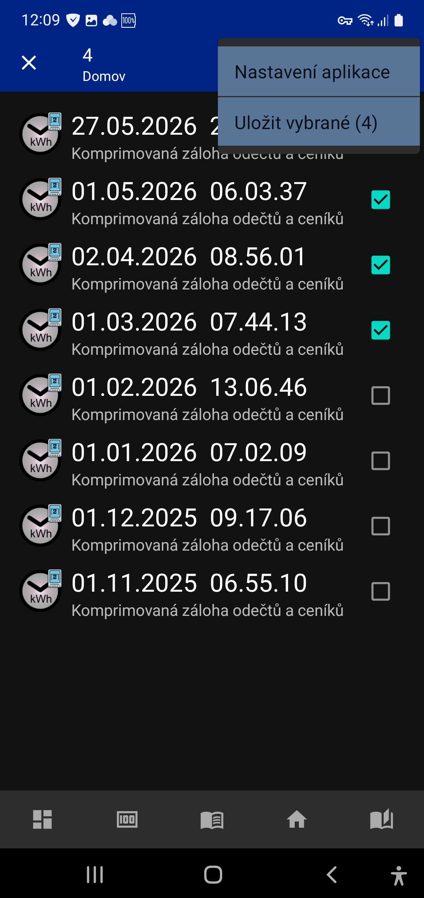
  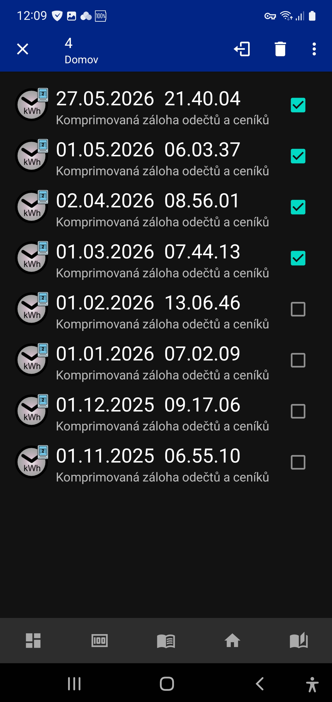

## Export ceníků

Export ceníků slouží k uložení vybraných ceníků z aplikace do souboru. Tato část vyžaduje přístup do lokální složky, která je společná se složkou pro ukládání záloh.

Ceníky se ukládají ve formátu JSON. Seznam obsahuje ceníky uložené v aplikaci a seskupené podle názvu. Jeden ceník může obsahovat více distribučních sazeb, například D01d, D02d nebo D25d.

Kliknutím na položku ceníku a potvrzením dialogu se ceník uloží do vybrané složky. Takto uložený soubor lze přenést do jiné instalace aplikace na jiném zařízení.

  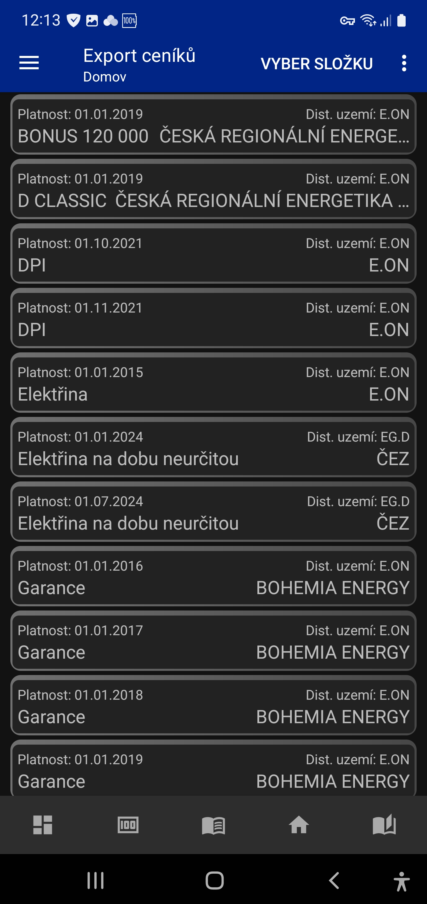

## Import ceníků

Import ceníků slouží k rychlému nahrání ceníku do aplikace. Importovaný ceník může obsahovat více distribučních sazeb.

Ceník přidáte krátkým klepnutím na položku. V zobrazeném dialogu vyberete distribuční sazby, které chcete přidat, a potvrdíte výběr tlačítkem **OK**. Pokud již v aplikaci existuje ceník se stejným názvem, aplikace se zeptá, zda jej chcete přepsat.

  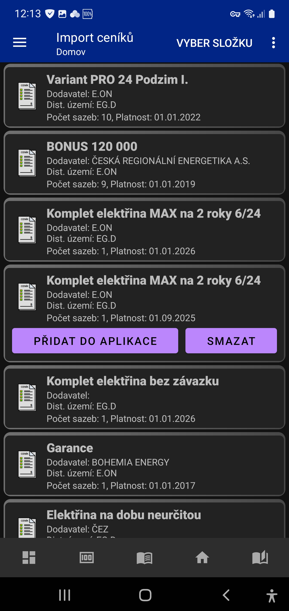

## Přehled

Přehled zobrazuje celkový výpočet ceny spotřeby, zaplacených záloh a rozdílu mezi těmito částkami. K dispozici jsou také údaje o časech NT a poslední uložený stav elektroměru.

Pomocí šipek je možné přepínat mezi jednotlivými odběrnými místy. Dolní seznam zobrazuje historickou spotřebu podle již uložených faktur.

  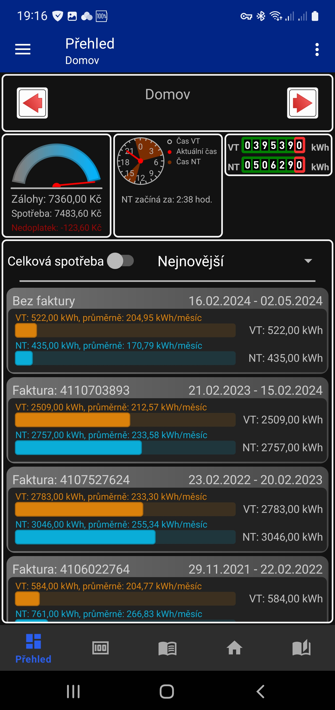

